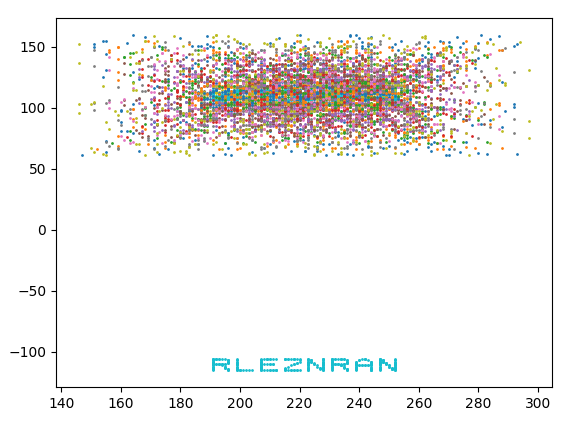
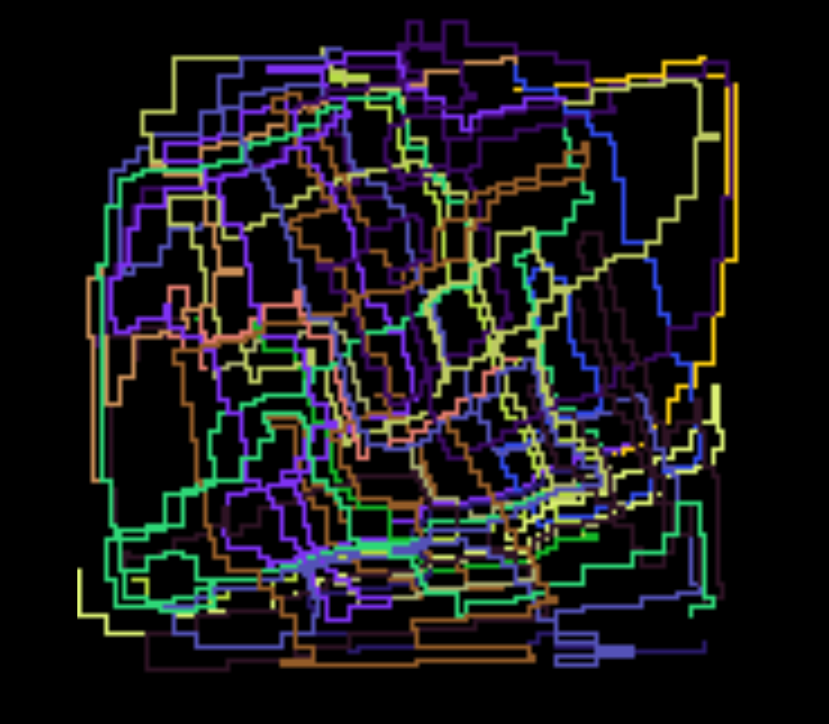

Advent of Code 2018
===================

Puzzles are found (here.)[https://adventofcode.com/2018/]

Other useful links
-------------------

* (Scatterplot of results)[http://www.maurits.vdschee.nl/scatterplot/]
* (AoC Subreddit)[https://www.reddit.com/r/adventofcode]

Day 1
======

Part 1 was easy, probably a little overkill with separate functions part1test() and part1(). But I think this may be a good structure to get used to for future puzzles.

First solution to part2 was very slow (1-2 minutes for my input):

```python
def find_repeatedfreq(sequence: [], f=0) -> int:
    freqs = [f]
    i = 0  # sequence index
    while True:
        f = freqs[-1] + sequence[i]
        if f not in freqs:
            freqs.append(f)
        else:
            return f
        if i == len(sequence) - 1:
            i = 0
        else:
            i = i + 1
```

The final solution uses a set instead of a list (duh...) and itertools.cycle() and completes in about 0.1s:

``` python
def find_repeatedfreq_itertools(sequence: [], f=0) -> int:
    freqs = set([f])
    for df in itertools.cycle(sequence):
        f = f + df
        if f not in freqs:
            freqs.add(f)
        else:
            return f
```

Day 2
======

Part 1:
---------
Compute a checksum for a list of box IDs from the following rules:
1. a = number of IDs that have exactly _two_ of any letter
2. b = number of IDs that have exactly _three_ of any letter
3. checksum = a * b

For Part 1, I chose to use collections.Counter and iterate over the resulting dictionary. With at most 26 items to evaluate, this should be pretty quick. The checksum() function then simply sums the number of _True_s for two_of_any and three_of_any separately and finally multiplies them together.

```python
def idcheck(id: str) -> Tuple[bool, bool]:
    """
    Count the number of times any letter appears in the ID
    and return tuple of booleans if any letters show up
    exactly twice          (two_of_any,
    or exactly thrice       three_of_any)
    """
    counter = Counter(id)
    two_of_any = False
    three_of_any = False
    for letters, count in counter.items():
        if count == 2:
            two_of_any = True
        if count == 3:
            three_of_any = True
    return (two_of_any, three_of_any)
```

Part 2:
---------
Find the two correct box IDs, which are identified by the fact that their IDs differ by exactly one character at the same position in both box ID strings. This differing character needs to be removed to get the correct answer.

Assuming the IDs all have the same length, one approach would be to remove the same character (by position) in turn in all of the IDs and then check if any two are the same. 

```python
def find_similar_id(ids: [str]) -> str:
    """ 
    Return the characters which the two similar IDs have in common.
    Similar is defined as: identical except for a single different
    character in the same position in both IDs 
    """
    
    N = len(ids[0])
    for n in range(N):
        myids = [id_[:n] + id_[n+1:] for id_ in ids]
        for id_ in myids:
            if myids.count(id_) > 1:
                return id_
```

I'm actually pretty happy with this solution.. At least I was not able to find one I liked better on the AoC Solution Megathread... :)

One interesting approach from there by u/CFD999 for Part 2 looks like:
```python
print((lambda strs: (lambda a,b: "".join([a[i] for i in range(len(a)) if a[i] == b[i]]))(*[(l1.strip(),l2.strip()) for l1 in strs for l2 in strs if l1 != l2 and sum(1 for i in range(len(l1)-1) if l1[i] != l2[i]) < 2][0]))(open('inp', 'r').readlines()))
```

Day 3
======

Went a little more for speed today, as I have some real work that needs to be done...so neither pretty nor efficient.
This was my initial approach for Part 2 which was really quite awful:
```python
def overlaps(c1: Tuple, c2: Tuple) -> bool:
    i1, x1, y1, w1, h1 = c1
    i2, x2, y2, w2, h2 = c2

    if i1 == i2:
        return False

    fabric = np.zeros((1000, 1000))
    fabric[x1:x1+w1, y1:y1+h1] += 1
    fabric[x2:x2+w2, y2:y2+h2] += 1

    if fabric.max() > 1:
        #print("{} and {} overlap".format(i1,i2))
        return True
    else:
        #print("{} and {} don't overlap".format(i1,i2))
        return False

def intact_claims(claims: [str]) -> [int]:
    intact = []
    for cli in claims:
        ovlps = 0
        cl1 = claim_to_slice(cli)
        for clj in claims:
            cl2 = claim_to_slice(clj)
            if overlaps(cl1, cl2):
                ovlps += 1
                break
                print(ovlps)
        if ovlps == 0:
            intact.append(cl1[0])  # index
    return intact
```

...but finally:
```python
def intact_claims(claims: [str]) -> [int]:
    intact = []
    fabric = np.zeros((1000, 1000))
    for claim in claims:
        i, x, y, w, h = claim_to_slice(claim)
        fabric[x:x+w, y:y+h] += 1

    for claim in claims:
        i, x, y, w, h  = claim_to_slice(claim)
        if np.all(fabric[x:x+w, y:y+h] == 1):
            intact.append(i)
    return intact
```

Once I realized I could go through each claim and check if any others overlap it (i.e. fabric[i,j] > 1) instead of comparing the areas of each claim with all others, everything got much simpler. 

Day 4
======

Spent waaaayyy to much time making complicated data structures which ended up not working. Pandas was also not the right approach here.At least I realized the sorting could be done naively, since the datetimes are in ISO format, which is nice. 

After a glance at some of the results on the AoC subreddit. I tried again with one defaultdict for the total time spent sleeping, and another for the most asleep minute.
Once the records were ordered, the guard ID was always known before the sleep/wake times were parsed, so I could simply fill the dicts and do max() and most_common() at the end.

The end result:
```python
def parse_records():

    total_sleeping = defaultdict(int)
    minutes_counter = defaultdict(Counter)

    # my input
    with open('data/day4') as f:
        records = f.read().splitlines()

        records.sort()
        fall_asleep_minute = 0

        for record in records:
            splitline = record.split()
            date = splitline[0][1:] 
            time = splitline[1][:-1]
            
            if 'begins shift' in record:
                guard = int(record.split()[3][1:])

            if 'falls asleep' in record:  # can asssume the hour is 00

                H = int(time.split(":")[0])
                M = int(time.split(":")[1])
                assert H == 0
                fall_asleep_minute = M

            if 'wakes up' in record:
                H = int(time.split(":")[0])
                M = int(time.split(":")[1])
                assert H == 0

                time_asleep = M - fall_asleep_minute
                assert time_asleep > 0
                #print("{} asleep from {} to {}".format(guard, fall_asleep_minute,M))
                cnt = Counter([i for i in range(fall_asleep_minute,M)])
                minutes_counter[guard].update(cnt)
                oldtotal = total_sleeping[guard]
                total_sleeping[guard] = oldtotal + time_asleep
    
    return total_sleeping, minutes_counter
```

All in all, should have sorted first and then done some thinking instead of plowing ahead..


Day 5
======

Not a huge challenge conceptually. Used list comprehension to create a list of reacting combinations:
```python
lc = [chr(i) for i in range(97, 97+26)]
uc = [c.upper() for c in lc]
reactants = [r[0] + r[1] for r in zip(lc, uc)]
reversedreactants = [r[::-1] for r in reactants]
```

and then simply replaced them in the polymer until its length remained constant. I was stuck for a bit with a dumb off by one error because I forgot to strip() the input!

For part 2 I went with a buteforce approach, removing each type in turn and reacting the result. Probably could be improved with some calls to count() so I don't check all 26.

Day 6
======

Already falling behind.. didn't manage to get up early enough to solve this one before class.
I need to stop immediately thinking of numpy if I have a field. In this case, I initially had something like this:
```python
field = np.ndarray(max_x+2, max_y+2), dtype=str)
for n in range(len(XY)):
    field[XY[n,0],XY[n,1]] = names[n]
```
For some reason, however, the array would still be empty immediately after the loop?!

Instead of a numpy array, I went with a dict, with the coordinate tuples as keys. For the areas (regions), a defaultdict of int (for the size of the area) worked well. To exclude the "infinite" areas at the edges, I increased the size of the grid by 1000 on each side, and then looked for the largest "realistic" number in the results. Not elegant, but it works.

Unfortunately I didn't have time for part two today. Maybe I'll come back to it.


Day 7
======

Today's lesson: Don't forget that Python passes by reference.  I had built a nice worker pool and task queue, only to get a wrong answer because after part1, my prerequisites dictionary was empty. So technically, this was solved yesterday.. ;-)


Day 8
=======

Trees are not my strong suit... But with some hints from /r/AdventOfCode, here goes:

```
2 3 0 3 10 11 12 1 1 0 1 99 2 1 1 2
A----------------------------------
    B----------- C-----------
                     D-----
```

Of the input,  I know that the first two numbers are the header of the root node, consisting of `(nchildren, nmetadata)`. The  rest `data` consists of the children of the node, and the metadata of the node. The `data` will start with a header of the first child of the node, if it has one. Else, the data consits of the metadata. So, recursively, I need to parse the data of the parsed data, carrying the total (sum of metadata) and returning the data without that child. Once all children of a node have been parsed, the next `nmeta` pieces of data are metadata. So:
```python
def parse(data):
    header = data[:2]
    data = data[2:]
 
    nchildren, nmeta = header

    totals = 0
    for n in range(nchildren):
        total, data = parse(data)
        totals += total

    totals += sum(data[:nmeta]) # first part is meta
    restdata = data[nmeta:] # restdata is everything after
    return totals, restdata
```

For part 2, the scores of each node needed to be calculated based on the scores of its children, where the metadata entries selected the children to be scored. A node with no children has a score of sum(metadata). So with an if condition to check the number of children, and a sum of either the metadata or the selected child scores, this was relatively simple. See the source.

This would have taken me days to solve if not for a great solution by /u/sciyoshi.

Day 9
=====

This problem involved a "circle" of values and indexing a certain number of values (counter-)clockwise in this circle. My initial idea to extend list into a circle seemed pretty cool at first:
```python
class Circle(list):
    
    def __getitem__(self, key):
        try:
            return super(Circle,self).__getitem__(key)
        except IndexError:
            key = key % len(self)
            return super(Circle,self).__getitem__(key)
            
    def __setitem__(self, key, item):
        try:
            super(Circle,self).__setitem__(key, item)
        except IndexError:
            key = key % len(self)
            super(Circle,self).__setitem__(key, item)

    def insert(self, indx, obj):
        if indx < len(self):
            super(Circle,self).insert(indx, obj)
        else:
            indx = indx % len(self)
            super(Circle,self).insert(indx, obj)

 ```

 However, I had imagined this to be much simpler. With the indexing also having to work counter-clockwise, this was going to be quite a few LOC that really weren't necessary. I ended up just using regular lists and adjusting the index by `idx % len(circle)`. See day09 for my solution to part1.
 
 For part 2, however, where the number of marbles was increased 100x, my implementation with normal lists was much to inefficient. Runtime was 1hr+. /u/marcusandrews has a great solution which makes use of double-ended queues and their rotate() function. This runs in about 1.5 seconds instead of hours.

 ```python
# solution with deque by /u/marcusandrews
def play_game_deque(max_players, last_marble):
    scores = defaultdict(int)
    circle = deque([0])

    for marble in range(1, last_marble + 1):
        if marble % 23 == 0:
            circle.rotate(7)
            scores[marble % max_players] += marble + circle.pop()
            circle.rotate(-1)
        else:
            circle.rotate(-1)
            circle.append(marble)

    return max(scores.values()) if scores else 0
 ```

 I also learned about (blist)[https://pypi.org/project/blist/], which is a replacement for `list` which is more efficient (O(log n)) instead of O(n)

 Day 10
 =======

 Today the goal was to find the message spelled out by points moving on an xy canvas over time. Since letters tend to have vertical or horizontal lines, I tried to find a "maximum alignment" and plot only for that timestep:
 

 I probably also could have counted the number of points which overlap, but the result is the same.

 Also, fastest part 2 ever: it asked for the timestep in which this happens, which I already had at that point.


 Day 11
 ========

 Today was nice and simple logic-wise - the instructions were pretty clear. the puzzle today was more in the performance. The goal: Find the largest sum of values of a subsquares on a square grid. For part 1 the size was fixed, so it was a simple convolution. For part 2, the subsquare could be anywhere from 1x1, to 300x300 (the size of the grid). Instead of recalculating the complete sum every time, I stored the previously calculated sums in a dict by (x,y,size). To compute the next larger square, I could look up the previous square with (x,y,size-1) and simply add the values on the edge. Like this (previous square: #, added values, *)
 ```
# # # # # # # *
# # # # # # # *
# # # # # # # *
# # # # # # # *
# # # # # # # *
# # # # # # # *
# # # # # # # *
* * * * * * * *
 ```

I also tried speeding up the (naive) summing with numba. This helped (runtime ~1.25 minutes instead of multiple). The speedup seems to come more from the JIT compilation instead of real parallelization...but it works.
The fastest solution was to combine both approaches by caching the results, and using numbda for the summing of the edge values. This runs through the whole computation in about 35 seconds.


Day 12
========

Cellular automata today. Part 1: evaluate for 20 generations. Part 2: evaluate for 50 Billion generations. Luckily, a pattern emerges after less than 200 generations and the answer can be extrapolated.
I was a little lazy: my code won't work for all inputs because there are two hardcoded values: the number of generations until "steady-state" and the score increment for the extrapolation.

Day 13
=======

Todays puzzle is a track, like
```
/->-\        
|   |  /----\
| /-+--+-\  |
| | |  | v  |
\-+-/  \-+--/
  \------/ 
```
just a little larger. The carets represent carts, which crash every now and then. The task was to determine the points at which they crash.
I went overkill with the objects on this one and also added a visualization using array2gif, which turns numpy arrays into gif images.

See day13.gif for the animated version.



For the next maze: a pretty cool trick from u/Shemetz 
```
Instead of storing x and y, store position = x + y * i (written y * 1j in python).

The best part about this is that directions are just one of the numbers +1, +1j, -1, -1j and changing a direction is as simple as multiplying it by either +1j (clockwise turn) or -1j (counterclockwise turn).

Note that since the Y axis is flipped (positive = down), you flip the imaginary part compared to what you'd do in usual mathematics (therefore, multiplying by +1j is CW ⭮, not CCW ⭯).
```

Full code [here](https://www.reddit.com/r/adventofcode/comments/a5qd71/2018_day_13_solutions/ebolyq6/?st=jpojqq6z&sh=ccd2da05)


Day 14
=======
Today wasn't as interesting, just follow the rules and make sure you're not off by one (as there are usually two, but sometimes on score being appended).

Day 15
======= 

A little overwhelmed today, to be honest. Just simulation really, but Lots of rules to follow and things to check and decide on. I'll come back to this one when I have more time..


Day 16
========
To much stuff to do today :(


Day 17
=======
Had to timebox this one. Looks like I'll be catching up on a few puzzles over Christmas break.